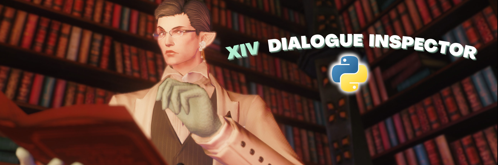

<h1 align="center">XIV Dialogue Inspector - Python Version </h1> 

 
  

This is the Python version of the XIV Dialogue Inspector, a program that allows you to easily access the dialogue files of Final Fantasy 14. This version was created to make the program more accessible to users who are more comfortable with Python.

**Note:** If you encounter any errors with the Python version, it may be because it is not currently synced up with the Java version in terms of code content. If you experience any issues with syntax errors in dialogue files, trouble getting a name to show up in your files, or anything else, please open an issue and try out the Java version first. You can also contact me on Discord if you are having any troubles.

## Purpose

This program is designed for people who want to easily access the dialogue of Final Fantasy 14. It is especially useful for roleplayers, lore seekers, and anyone who wants to find information or quotes from the game.

## Features

- Reads the Dialogue CSV files of Final Fantasy 14
- Displays dialogue in chronological order
- Sorts through all dialogue in the game except for the `NpcYell.csv` file
- Allows users to search for all dialogue of a specific character or all instances of a word
